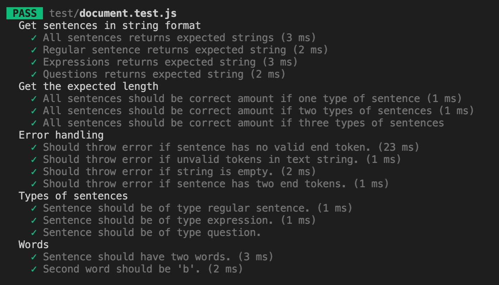
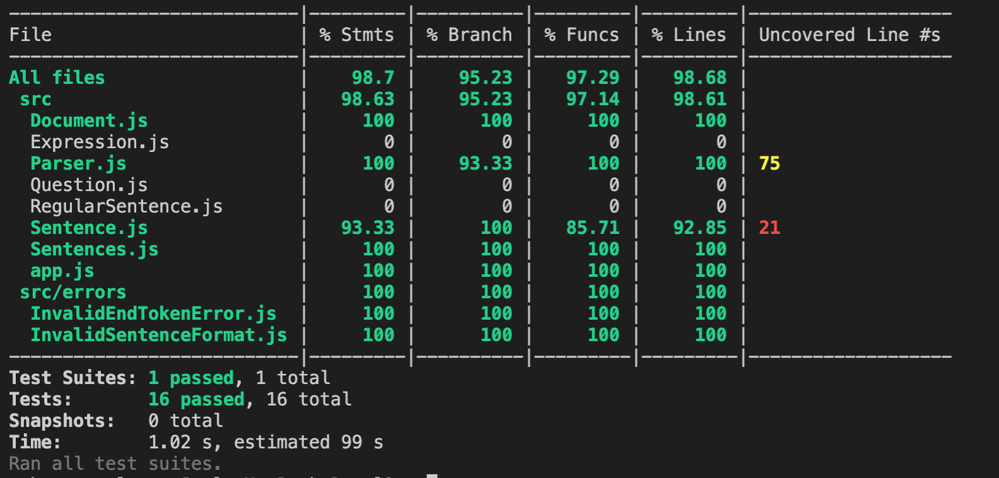

# Mall för inlämning laboration 1, 1dv610

## Checklista
  - [x] Jag har skrivit all kod och reflektioner själv. Jag har inte använt mig av andras kod för att lösa uppgiften.
  - [x] Mina testresultat är skrivna utifrån utförd testning ( och inte teoretiskt, "det bör fungera" :) )
  - [x] De enda statiska metoder eller funktioner utanför klasser som jag har är för att starta upp min testapplikation ex main(java).
  - [x] De enda bibliotek och färdiga klasser som används är sådana som måste användas (eller som används för att testa modulen).

## Egenskattning och mål
  - [ ] Jag är inte klar eftersom jag vet att jag saknar något. Då skall du inte lämna in!
  - [ ] Jag eftersträvar med denna inlämning godkänt betyg (E-D)
    - [x] De flesta testfall fungerar (enstaka testfall kan misslyckas, tydligt vilka)
    - [x] Koden är förberedd på återanvändning
    - [x] All kod samt historik finns i git 
    - [x] Reflektionerna är skrivna
    - [x] Koden är läsbar
  - [x] Jag eftersträvar med denna inlämning högre betyg (C) och anser mig uppfylla alla extra krav för detta. 
    - [x] Jag är noga i min testning
    - [x] En del av testfallen är automatiserade (Tokenizer/Parser/PP), viss del kan vara manuellt testad.
    - [x] Det finns en tydlig beskrivning i hur mina moduler skall användas. 
    - [x] Mina reflektioner visar tydligt att jag förstått bokens koncept.
  - [ ] Jag eftersträvar med denna inlämning högsta betyg (A-B) 
    - [ ] Sammanhängande reflektion som ger ett gott helhetsintryck och visar detaljerad förståelse för kodkvalitet.
    - [ ] Min kod är ... (pussar fingrar och gör smackljud)
    - [ ] Extrauppgift parser finns med som egen modul(er)


Förtydligande: Examinator kommer sätta betyg oberoende på vad ni anser. Att ha "saker" från högre betygsnivåer verkar positivt och kan väga upp brister i inlämningen.

## Komponenter och återanvändning
Min kod består av en [Tokenizer](https://gitlab.lnu.se/1dv610/student/ra223ai/l1), som tar en text och plockar ut tokens som stämmer överens med en given grammatik. [Parser](readme.md) använder sig av Tokenizern och kommer från de givna tokens identifiera meningar som slutar med ".", "!" eller "?". Meningarna kan vara av typen Regular, Expression och Question beroende på vilket tecken de slutar med. Texten som ska parsas kan skickas in via [PrettyPrinter](https://gitlab.lnu.se/ra223ai/1dv610-laboration-2-ui) som sedan kommer att printa de parsade meningarna i rätt ordning samt med olika stil beroende på typen av mening.

 Koden är anpassad för återanvänding genom att huvudmetoden som exporteras returnerar ett objekt, på vilket ett antal publika metoder kan anropas för att utföra olika handlingar eller hämta ut olika data.

 Parser använder sig Tokenzier genom att installera modulen som ett npm-paket. PrettyPrinter i sin tur installerar Parser som ett npm-paket. Genom att göra mina moduler till npm-paket som kan installeras är de väl separerade från varandra och det krävs en installation för att det ska bli ett beroende.

## Beskrivning av min kod
Min applikation tar emot en textsträng som sedan tokeniseras. Utifrån dessa tokens skapas sedan meningar upp som kan delas in i olika typer av meningar. Mening som slutar med punkt (.) är en RegularSentence, mening som slutar med utropstecken (!) är Expression och mening som slutar med frågetecken (?) är Question. Samtliga meningar lagras sedan i ett dokument. Dokumentet är det som returneras när modulen används och från dokumentet kan man sedan hämta ut alla meningar eller meningar beroende på typ av mening. Det går sedan även att hämta ut en sammanbyggd mening i form av en textsträng. 

```Document```<br>
*Tar en instans av ```Parser``` och ```Sentences``` som argument*
- ```fetchAllSentences()```: returnerar ett ```Sentences```-objekt
- ```fetchRegularSentences()```: returnerar en array med ```RegularSentence```-objekt
- ```fetchExpressions()```: returnerar en array med ```Expression```-objekt
- ```fetchQuestions```: returnerar en array med ```Question```-objekt

```Parser```<br>
*Tar en instans av ```Tokenizer``` och ```Sentences``` som argument*
- ```buildSentencesFromTokens()``` - anropas av ```Document```, går igenom de tokens som hittats av Tokenizer och konstruerar Sentence-objekt av rätt typ (```RegularSentence```, ```Expression``` eller ```Question```)

```Sentences```
- ```parsedSentences```: en getter som returnerar en array med ```RegularSentence```-, ```Expression```- och ```Question```-objekt

```RegularSentence```, ```Expression``` och ```Question```
- ```getStringSentence```: en getter som returnerar meningen i strängformat


## Hur jag testat
* Parser: automatiska enhetstester med hjälp av Jest. 
* PrettyPrinter: manuella tester.

De automatiska testerna för arser har jag skrivit tidigt i utvecklingsprocessen och sedan kört regressionstester regelbundet för att kontrollera att koden fortfarande fungerar efter att nya features introducerats, kod refaktorerats osv. 

### Testfall
| Namn      | Indata | Förväntat Utfall | PASS/FAIL |
| --------- | ------ | ---------------- | --------- |
| TC1. All sentences returns expected strings | 'Aa bb. A b!' | ['Aa bb.', 'A b!'] | :white_check_mark: |
| TC2. Regular sentence returns expected string | 'A b.' | 'A b.' | :white_check_mark: |
| TC3. Expressions returns expected string | 'Aa bb. A b!' | 'A b!' | :white_check_mark: |
| TC4. Questions returns expected string | 'Aa bb. A b? Bb!' | 'A b?' | :white_check_mark: |
| TC5. All sentences should be correct amount if one type of sentence | 'Aa bb. A b.' | 2 | :white_check_mark: |
| TC6. All sentences should be correct amount if two types of sentences | 'Aa bb. A b!' | 2 | :white_check_mark: |
| TC7. All sentences should be correct amount if three types of sentences | 'Aa bb. A b? Bb!' | 3 | :white_check_mark: |
| TC8. Should throw error if sentence has no valid end token. | 'Bb' | InvalidTokenError | :white_check_mark: |
| TC9. Should throw error if unvalid tokens in text string. | 'Bb*' | Error | :white_check_mark: |
| TC10. Should throw error if string is empty. | '  ' | Error | :white_check_mark: |
| TC11. Should throw error if sentence has two end tokens. | 'Aa!?' | InvalidSentenceFormat | :white_check_mark: |
| TC12. Sentence should be of type regular sentence. | 'A b.' | true | :white_check_mark: |
| TC13. Sentence should be of type expression. | 'A b!' | true | :white_check_mark: |
| TC14. Sentence should be of type question. | 'A b?' | true | :white_check_mark: |
| TC15. Sentence should have two words | 'A b.' | 2 | :white_check_mark: |
| TC16. Second word should be 'b'. | 'A b.' | 'b' | :white_check_mark: |

Screenshots från automatisk testning:



[Testfall och testrapport](https://docs.google.com/document/d/1Q_JXJrX656hw_FFVIddJkQMdCk7Z1rdIb1Y8xizGHJ8/edit) för manuella tester avseende PrettyPrinter.

## Kapitelreflektioner för kapitel 2-11
Kapitelreflektioner finns [här](https://docs.google.com/document/d/143u7TiyQpqgmYeNaQ4g9XDsZvJylrIckLx61HSkn5Rg/edit#)

## Laborationsreflektion
Jag har lärt mig mer om hur man tänker kring att utveckla moduler. Vilken modul som ska ha ansvar för vad och hur den kan göras återanvändbar utan för många beroenden. Jag har också "tvingats" lära mig hur man publicerar sina egna paket på npm - vilket känns som en väldigt användbar kunskap och ett smidigt sätt att bygga sin egen kod i återanvändbara moduler även i andra projekt. Jag har fortsatt utvecklas i sättet att tänka kring klasser och metoder - hur ansvar ska fördelas och hur de ska ska skrivas på ett cleant sätt.
